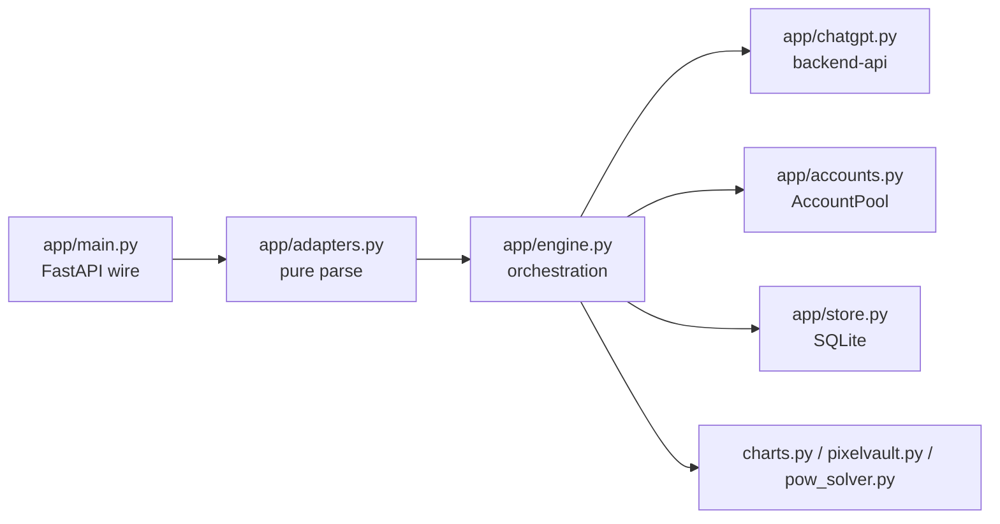

# Repository Guidelines

## Project Overview

Local OpenAI-compatible API over ChatGPT web accounts. FastAPI serves `Chat Completions` + `Responses` on `127.0.0.1:4035` via plain HTTPS to `chatgpt.com` backend-api with TLS impersonation + sentinel PoW — no browser automation.

## Architecture & Data Flow

Layered proxy, no DI framework. Module singletons `POOL` / `STORE` imported directly; `run_turn` / `collect` take `pool` explicitly. Fully async (`AsyncIterator` SSE, `curl_cffi AsyncSession`).



Turn lifecycle (`app/main.py` → `app/engine.py` → `app/chatgpt.py`):

1. **Parse:** `_body()` → `parse_chat_request` / `parse_responses_request` → `ParsedRequest{system_text, items: HistoryItem[]}`. Text files fenced as markdown; binaries kept as `ImageInput` / `FileInput`.
2. **Plan:** `_plan()` builds rolling `item_hash` chain over `HistoryItem.canon()` → `STORE.find()` longest-prefix `ConvRef`; or loads `ResponseRecord.snapshot` for `previous_response_id` (full replay incl. binaries).
3. **Attempt loop:** prefer snapshot owner / `x-chatgpt-account` header, then walk every available account once (`acquire(exclude=tried)` sorted by `(inflight,last_used)`, `release` in `finally`). Per attempt: `models()` → `map_model()` → re-upload media to that account → `AccountSession.stream_conversation()`.
4. **Stream processing:** withhold deltas through refusal gate (`IMAGE_LIMIT_RE`, `_classify_accumulated` → `_ImageLimitError` before first byte) and citation resolution. Rewrite `\ue200…\ue201` cites to titled markdown links (strip `utm_*`), strip non-cite widgets, render `genui` charts → `render_chart_png` → PixelVault URL tail. Zero bytes + failure → `report_status()` + failover; bytes produced → salvage + re-raise.
5. **Render:** `chat_stream` / `responses_stream` wrap engine events into Chat (`chat.completion.chunk` + `[DONE]`) or Responses (`response.created/.../completed`) SSE. Non-stream: `collect()` → single JSON. `ChatGPTError(status)` → `EngineError(status, error_type)` → `oai_error()` JSON or in-band SSE error.
6. **Background:** `AccountPool.watch` (2s `mtime` poll: hot-swap + `_persist_state` JWT/cookies back to `accounts.txt` under `flock`) + `keepalive_tick` (eager refresh within `KEEPALIVE_REFRESH_WITHIN`, dead-probe/revive, strike counting). Ephemeral LB/health in memory, continuation in SQLite, auth in `accounts.txt`.

## Key Directories

- `app/` — only source tree, flat, 11 files, no subpackages. `main.py`, `config.py`, `adapters.py`, `engine.py` (~1851 lines, largest), `chatgpt.py`, `accounts.py`, `store.py`, `charts.py`, `pixelvault.py`, `pow_solver.py`, `__init__.py` (docstring only).
- `tests/` — only test root, 5 specs, no `conftest.py` / `fixtures/` / `helpers/`.
- `data/` — runtime SQLite WAL (`conversations.db*`), gitignored, never source.
- Root — configs + `run.sh` / `restart.sh` + `README.md`. No `src/`, `lib/`, `server/`, `scripts/`, `tools/`, `docs/`, `examples/`, `Dockerfile`, `.github/`.

## Development Commands

No build step (`[tool.uv] package = false`).

```bash
./run.sh                          # foreground: bootstrap .venv if missing, exec python -m app.main
./restart.sh                      # detached: pkill, setsid nohup > server.log, poll GET /healthz ~15s
.venv/bin/python -m app.main      # direct (equiv. python -m app.main) → uvicorn HOST:PORT
uv run pytest                     # tests (or .venv/bin/pytest); python -m unittest per file also works
uv run ruff check .               # lint
uv run ruff format                # format (owns trailing commas per COM812)
uv run ty check                   # typecheck
```

Install (handled by `run.sh` / `restart.sh`): `uv venv .venv && uv pip install --python .venv/bin/python -r requirements.txt`, fallback `python3 -m venv .venv && .venv/bin/pip install -r requirements.txt`.

## Code Conventions & Common Patterns

- Python `>=3.11`, `from __future__ import annotations` everywhere; `snake_case` funcs/vars, `UPPER_SNAKE` consts, `CamelCase` DTOs, `_leading_underscore` privates; one module per concern; `log = logging.getLogger(<name>)`.
- Typing strict: `dict[str, object]` wire types, `dataclass` DTOs (`ParsedRequest`, `HistoryItem`, `TurnResult`), `TypeGuard` helpers (`_is_dict` / `_is_list`), `X | None` + `_optional_*` / `_require_*` validators in `app/adapters.py`.
- Docs: every def has one-line Google-style docstring; file header `# Copyright 2026…` + module docstring describing protocol.
- Errors typed with status: `ChatGPTError`, `EngineError(status, message, error_type)`, `PixelVaultError`, `ChartError(ValueError)`, `_ImageLimitError` (control-flow). `contextlib.suppress` for best-effort cleanup. Unsupported input → clear `400` (tool calls, audio, tool-call replay, server-side `file_id`).
- Async: `AsyncIterator[str]` SSE, `curl_cffi AsyncSession` for all outbound HTTP, fire-and-forget `_track_task` set; only `app/store.py` uses `threading.RLock` + thread-local SQLite (WAL).
- HTTP hardening in `app/adapters.py`: `fetch_remote` DNS-resolves and refuses loopback/private/link-local/reserved/multicast (SSRF guard); `estimate_tokens` ≈ 4 chars/token.
- Request knobs: `x-chatgpt-account: <email>` pins account; `{"include_sources": true}` / `extra_body` per-request or `CHATGPT_INCLUDE_SOURCES=1` (`INCLUDE_SOURCES` alias) globally.
- `accounts.txt`: Netscape-jar + `<<<…>>>` session-JSON blocks, hot-reload ~2s, dedup by user id, `flock` + `.tmp` + rename; never commit.

## Important Files

- `app/main.py` — entrypoint `app: FastAPI`, routes (`GET /v1/models`, `POST /v1/chat/completions`, `POST /v1/responses`, `GET /healthz`, `GET /v1/accounts`, each with bare alias), `auth_ok()` (hmac-compare `API_KEY`), `_body()`, `_sse()`, `oai_error()`, `lifespan` (`POOL.start_watcher()`).
- `app/config.py` — authoritative env reference; hand-rolled `_load_dotenv` via `setdefault` (real env wins, strips one quote layer, does NOT strip inline comments — values must be bare). Keys: `HOST=127.0.0.1`, `PORT=4035`, `ACCOUNTS_FILE`, `DB_PATH=data/conversations.db`, `API_KEY`, `DEFAULT_MODEL=auto`, `COOLDOWN_*`, `REQUIREMENTS_TTL`, `CONVERSATION_TTL_HOURS`, `SNAPSHOT_*_CAP_MB`, `KEEPALIVE_*`, `UA`, `TLS_IMPERSONATE=chrome`, `PIXELVAULT_*`.
- `app/adapters.py` — `ParsedRequest`, `HistoryItem.canon()`, `ImageInput` / `FileInput`, `map_model` + `LIVE_SLUG_ALIASES`, `parse_chat_request` / `parse_responses_request`.
- `app/engine.py` — `TurnResult`, `EngineError`, `run_turn()` / `collect()`, `_plan`, refusal gate, `_CITE_*_RE` rewriting, chart/PixelVault tail.
- `app/chatgpt.py` — `AccountSession` (`refresh_access_token`, `ensure_token`, `stream_conversation`, `models()` hourly cache, `upload_file`), `parse_accounts_text` / `block_session`, PoW flow `GET /api/auth/session` → `GET /?oai-dm=1` → `POST /sentinel/chat-requirements` → `POST /conversation` (SSE).
- `app/accounts.py` — `AccountPool` (`load`, `watch`, `keepalive_tick`, `acquire(preferred_identity, exclude)`, `release`, `report_status`, `persist_state`), singleton `POOL`.
- `app/store.py` — `ConversationStore` (WAL, `prefixes` + `responses` tables, `find(hashes)` prefix match, snapshot trim drops largest binaries first), `item_hash` / `canon_content`, singleton `STORE`.
- `app/charts.py` — `chart_from_payload`, `render_chart_png` (bar/column only, `MAX_CHART_ROWS=400`, DejaVu+PIL).
- `app/pixelvault.py` — `upload_image(name, data, mime) -> url` (`CurlMime` multipart to `$BASE/v1/images`).
- `app/pow_solver.py` — `solve(seed, difficulty, options)` sha3-512 hashcash, `pre_proof(user_agent)`.
- `pyproject.toml` — sole tool config (deps, `ruff select=["ALL"]` ignore `D203,D213,COM812` + `tests/**: S101`, `ty all="error"` strict, `pytest testpaths=["tests"] pythonpath=["."]`).
- `.env.example` — committed template (`PIXELVAULT_API_KEY`, `PORT`, `DB_PATH`, `CHATGPT_INCLUDE_SOURCES`); `.env` / `accounts.txt*` / `server.log` / `data/` / `*.db*` / `.venv/` gitignored.
- `README.md` — sole doc (setup, `.env`, `accounts.txt` format, endpoints, multi-turn/snapshot design, files/images, Show Sources, non-goals, limits).
- `run.sh` / `restart.sh` — venv-bootstrap launchers (uv preferred, pip fallback).

## Runtime/Tooling Preferences

- CPython `3.11` only (`requires-python >=3.11`, `.python-version`, ruff `py311`, `ty 3.11`). Manager `uv >=0.12.9` primary, `pip` fallback; venv at `.venv/`; locked deps `uv.lock`, launchers install from `requirements.txt` (mirrors runtime).
- Runtime deps only: `fastapi`, `uvicorn[standard]`, `curl_cffi>=0.7`, `pillow`. Dev group: `ty`, `ruff`, `pytest`, `typing-extensions`.
- Validate locally, no CI/container/JS toolchain: `ruff check` (`ALL`, Google convention), `ruff format`, `ty check` (`all="error"` + strict equality/generic narrowing + `error-on-warning`), `pytest`.
- Always use `https://docs.astral.sh/uv/` with everything enabled and `https://docs.astral.sh/ty/` with everything enabled, then fix all of the issues. Fix source, never suppress (`noqa`, `type: ignore`, narrowing rule ignores, `per-file-ignores` widening, rule downgrades).
- Env discipline: secrets (`.env`, `accounts.txt`, `PIXELVAULT_API_KEY`) never committed; `HOST` defaults loopback (`0.0.0.0` only for LAN); keepalive values bare numbers.

## Testing & QA

- Runner `pytest` (locked `9.1.1`), authoring style `unittest.TestCase` — `class Test<Phenomenon>(unittest.TestCase)` + `def test_<behavior>_<expectation>`, one-behavior docstrings, `if __name__ == "__main__": unittest.main()` footer. `asyncio.run()` drives async paths (no `pytest-asyncio`, no fixtures/marks/`parametrize`/`tmp_path`/`monkeypatch` — zero hits).
- Layout `tests/test_<subject>.py` (~44 methods, subject = subsystem not module mirror): `test_keepalive.py` (~22: cookie absorption, refresh strikes/throttle/transient-503, atomic `persist_state`, hot-swap freshness/dead-revive, render round-trip), `test_store.py` (5: SQLite prefix/branch/response/snapshot, legacy-hex compat, txn rollback), `test_branch_race.py` (8: 2 interleaved-branch single-delivery + 6 `_render_citations` / `_jsx_cite_cut` pure units), `test_image_refusal_failover.py` (5: exact/variant/chunked/quoted/normal-phrase 200-stream refusal → failover, zero-byte leak), `test_upstream_error.py` (4: `metadata.is_error` refusal + incomplete-stream 502).
- Doubles are per-file, not shared: local `FakeAccount(AccountSession)` replaying canned `SSEEvent` dicts via `_user_then()` / `_msg()` helpers (`_mk_jwt`, `_mk_session`, `_mk_block`, `REFUSAL_EVENTS` / `OK_EVENTS` / `RACE_EVENTS`); `FakeResponse` / `FakeSession` + `unittest.mock.patch.object` for keepalive. State isolation via `tempfile.mkdtemp()` for `config.ACCOUNTS_FILE` / `*.db` + restore/`rmtree` in `setUp`/`tearDown`. Assertions: bare `assert` (allowed by `S101` carve-out) + `pytest.raises` / `pytest.fail` on failover paths.
- No coverage gate: no `[tool.coverage]`, `codecov.yml`, `addopts`. All tests hermetic (no network, no real `data/` DB outside tempdirs). Example: `uv run pytest tests/test_store.py -q`.
